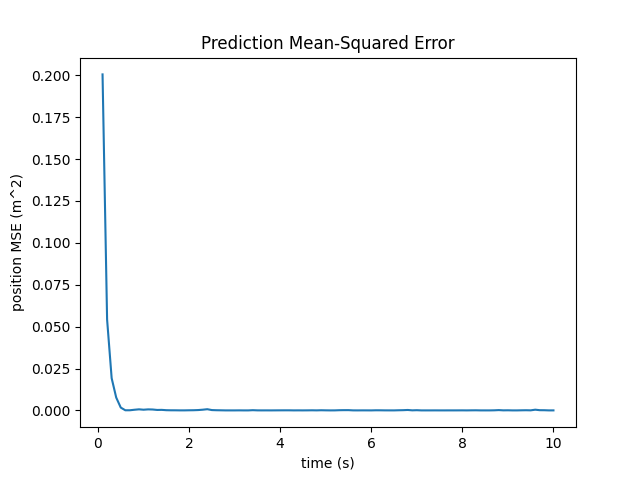
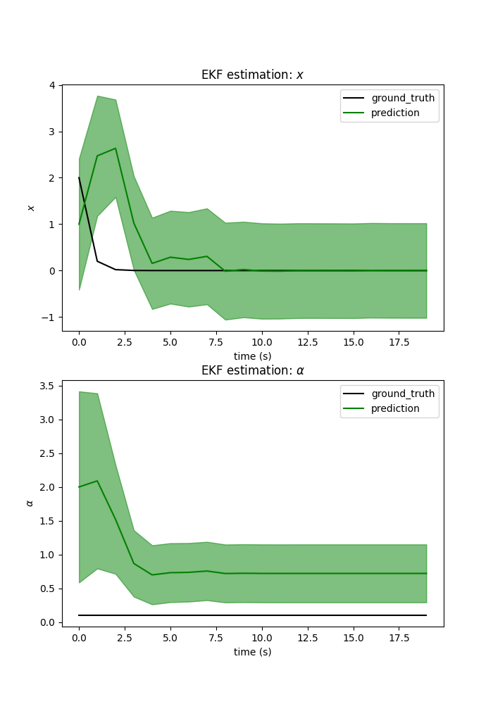

# Kalman Filters and Extended Kalman Filters (EKFs)
 
 This project include 2 parts:
 1. Implementation of the Kalmen Filter in 1D world
 2. Implementation of the Extended Kalmen Filter (EKFs) in 1D world

## Part 1: Kalmen Filter
A Kalman filter is a special case of the Bayes filter where the dynamics and sensory model is linear Gaussian. Kalman filters are used where there is uncertain information about a dynamic system and you need to make a guess or form a belief about what the system will do next. They do not store more than the previous state, and are defined for continuously changing systems only.

Implementation of the Kalman filter is included in file *KF.py*, with an instance described below.

We want to track the 1-D position of an object of unknown dynamics with the constant jerk model, i.e. $$x(t) = [p_t, v_t, a_t, j_t]^T$$ (position, velocity, acceleration and jerk).

 - $$x(t + 1) = Ax(t) + w(t)$$, where $$w(t)$$ is fictitious noise
 - $$z(t) = Cx(t) + v(t)$$, where $$v(t)$$ is sensor noise
 - True position $$p(t) = sin(0.1 * t)$$
 - Sensor data $$p(t) = p(t) + v_m(t)$$, where $$v_m(t)$$ is generated sensor noise

Values are defined in *KF.py*. The prediction MSE is shwon below:

## Part 2: Extended Kalmen Filter
Extended Kalman Filter is a non-linear version of Kalman Filter. Implementation of the Extended Kalman filter is included in file *EKF.py*, with an model similar to part 1.

 - $$x(t + 1) = \alpha x(t) + w(t)$$
 - $$z(t) =\sqrt {x(t)^2 + 1} + v(t)$$

Initial estimations and ground truth are defined in *KF.py*. The prediction MSE is shwon below:

